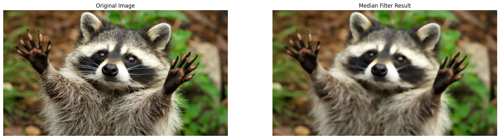
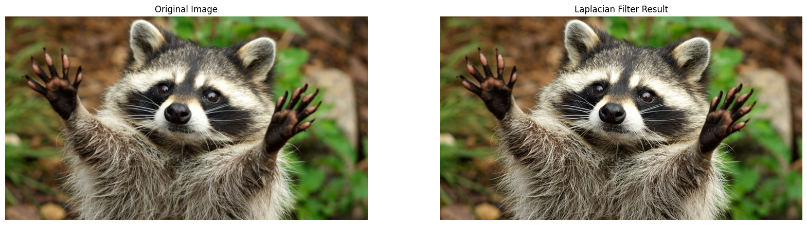
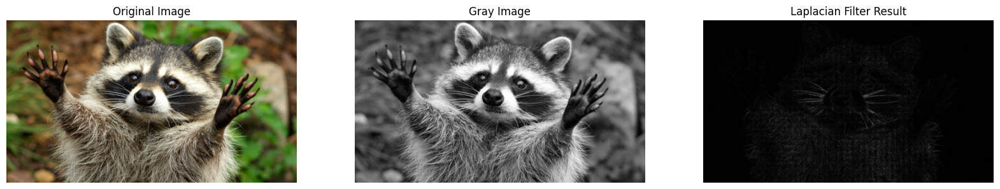

# Implementation-of-filter
## Aim:
To implement filters for smoothing and sharpening the images in the spatial domain.

## Software Required:
Anaconda - Python 3.7

## Algorithm:
### Step1
Import the required libraries.

### Step2
Convert the image from BGR to RGB.

### Step3
Apply the required filters for the image separately. 

### Step4
Plot the original and filtered image by using matplotlib.pyplot. 

### Step5
End the program.

## Program:
```
Developed By   : KRISHNA PRASAD S
Register Number: 212223230108
```

### 1. Smoothing Filters

i) Using Averaging Filter
```Python

import cv2
import matplotlib.pyplot as plt
import numpy as np

image = cv2.imread("raccoon.jpg")
image1 = cv2.cvtColor(image1,cv2.COLOR_BGR2RGB)
kernel = np.ones((5,5), dtype = np.float32) / 5**2
image2 = cv2.filter2D(image1, ddepth = -1, kernel = kernel)

plt.figure(figsize=(20, 8))
plt.subplot(1,2,1); plt.imshow(image1); plt.title("Original Image"); plt.axis("off")
plt.subplot(1,2,2); plt.imshow(image2); plt.title("Convolution Result"); plt.axis("off")

```
ii) Using Weighted Averaging Filter
```Python

avg_fltr = cv2.blur(image1, (30,30))

plt.figure(figsize=(20, 8))
plt.subplot(1,2,1); plt.imshow(image1); plt.title("Original Image"); plt.axis("off")
plt.subplot(1,2,2); plt.imshow(avg_fltr); plt.title("Average Filter Result"); plt.axis("off")

```
iii) Using Gaussian Filter
```Python

gaussian_filter = cv2.GaussianBlur(image1, (29,29), 0, 0)

plt.figure(figsize=(20, 8))
plt.subplot(1,2,1); plt.imshow(image1); plt.title("Original Image"); plt.axis("off")
plt.subplot(1,2,2); plt.imshow(gaussian_filter); plt.title("Gaussian Filter Result"); plt.axis("off")

```
iv)Using Median Filter
```Python

median_filter = cv2.medianBlur(image1, 19)

plt.figure(figsize=(20, 8))
plt.subplot(1,2,1); plt.imshow(image1); plt.title("Original Image"); plt.axis("off")
plt.subplot(1,2,2); plt.imshow(median_filter); plt.title("Median Filter Result"); plt.axis("off")

```

### 2. Sharpening Filters
i) Using Laplacian Linear Kernal
```Python

laplacian_kernel = np.array([[0, -1, 0],
                             [-1, 5, -1],
                             [0, -1, 0]])
sharpened_laplacian_kernel = cv2.filter2D(image1, -1, kernel = laplacian_kernel)

plt.figure(figsize=(20, 8))
plt.subplot(1,2,1); plt.imshow(image1); plt.title("Original Image"); plt.axis("off")
plt.subplot(1,2,2); plt.imshow(sharpened_laplacian_kernel); plt.title("Laplacian Filter Result"); plt.axis("off")

```
ii) Using Laplacian Operator
```Python

gray_image = cv2.cvtColor(image1, cv2.COLOR_RGB2GRAY)
laplacian_operator = cv2.Laplacian(gray_image, cv2.CV_64F)
laplacian_operator = np.uint8(np.absolute(laplacian_operator))

plt.figure(figsize=(20, 10))
plt.subplot(1,3,1); plt.imshow(image1); plt.title("Original Image"); plt.axis("off")
plt.subplot(1,3,2); plt.imshow(gray_image, cmap = 'gray'); plt.title("Gray Image"); plt.axis("off")
plt.subplot(1,3,3); plt.imshow(laplacian_operator, cmap = 'gray'); plt.title("Laplacian Filter Result"); plt.axis("off")

```

## OUTPUT:
### 1. Smoothing Filters

i) Using Averaging Filter


ii)Using Weighted Averaging Filter


iii)Using Gaussian Filter


iv) Using Median Filter


### 2. Sharpening Filters

i) Using Laplacian Kernal


ii) Using Laplacian Operator


## Result:
Thus the filters are designed for smoothing and sharpening the images in the spatial domain.
